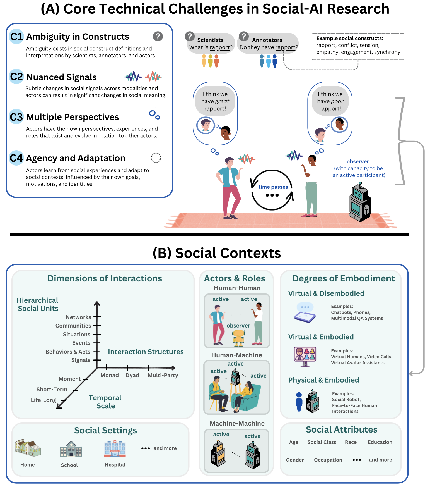

# social-ai

Repo by [Leena Mathur](https://l-mathur.github.io) from the [Language Technologies Institute](https://www.lti.cs.cmu.edu) at CMU's [School of Computer Science](https://www.cs.cmu.edu). 

This repository contains resources related to advancing socially-intelligent AI (Social-AI) agents. If there are any topics, papers, books, benchmarks, courses, or dissertations you would like added, please feel free to make a pull request or email lmathur@andrew.cmu.edu. All suggestions or contributions are welcome! 

This repository accompanies the EMNLP 2024 position paper [Advancing Social Intelligence in AI Agents: Technical Challenges and Open Questions](https://arxiv.org/abs/2404.11023) by [Leena Mathur](https://l-mathur.github.io/), [Paul Liang](https://www.cs.cmu.edu/~pliang/), and [Louis-Philippe Morency](https://lti.cmu.edu/people/faculty/morency-louis-philippe.html) from the [Language Technologies Institute](https://www.lti.cs.cmu.edu) and [Machine Learning Department](https://www.ml.cmu.edu/) at CMU. The [paper](https://arxiv.org/abs/2404.11023) discusses core technical challenges, opportunities, and open questions, towards advancing social intelligence in AI agents. 

<p align="center">
  

  <em>(A) Four core technical challenges in Social-AI research, illustrated in an example context of a Social-AI
agent observing and learning from a human-human interaction. (B) Social contexts in which Social-AI agents can
be situated, spanning interaction dimensions/structures, social settings, degrees of agent embodiment, and social attributes of humans, with agents in several roles.</em>
</p>

**C1: Ambiguity in Constructs** (Section 4.1 of the paper)

*Social constructs have inherent ambiguity in their definition and interpretation in the social world.* 

**C2: Nuanced Signals** (Section 4.2 of the paper)

*Social constructs are expressed through behaviors and signals that can be nuanced, often manifesting through different degrees of synchrony across actors and modalities. During interactions, small changes in social signals can lead to large shifts in social meaning being conveyed.* 

**C3: Multiple Perspectives** (Section 4.3 of the paper)

*In social interactions, actors bring their own perspectives, experiences, and roles; these factors can change over time and influence the perspectives of other actors during interactions.* 

**C4: Agency and Adaptation** (Section 4.4 of the paper)

*Actors learn from social experiences and adapt to social contexts, through interactions, influenced by their own agency, goals, motivations, and identities.*

```bibtex
@misc{mathur2024advancing,
      title={Advancing Social Intelligence in AI Agents: Technical Challenges and Open Questions}, 
      author={Leena Mathur and Paul Pu Liang and Louis-Philippe Morency},
      year={2024},
      eprint={2404.11023},
      archivePrefix={arXiv},
      primaryClass={cs.HC}
}
```

# Table of Contents

[Social Intelligence Foundations](#social-intelligence-foundations)

[Social-AI Research](#social-ai-research)

[Ethics, Safety, and Participatory Social-AI](#ethics-safety-and-participatory-social-ai)

[Benchmarks](#benchmarks)

[Courses](#courses)

[Dissertations](#dissertations)

[Additional Positions and Surveys](#additional-positions-and-surveys)


# Social Intelligence Foundations 

## What is a social entity? 

[The Construction of Social Reality](https://books.google.co.in/books?hl=en&lr=&id=zrLQwJCcoOsC&oi=fnd&pg=PR9&dq=+%22searle%22%22The+construction+of+social+reality%22&ots=1tfnSn_xwS&sig=EtU76LM_WRJ-23yLPwiC_70l5O4#v=onepage&q=%22searle%22%22The%20construction%20of%20social%20reality%22&f=false), 1995

[Social Ontology and the Philosophy of Society](https://www.degruyter.com/document/doi/10.1515/auk-1998-0201/html), Analyse & Kritik, 1998

[The Evolutionary Emergence of Language: Social Function and the Origins of Linguistic Form](https://books.google.com/books?hl=en&lr=&id=2dtOaRpJ5sAC&oi=fnd&pg=PR9&dq=The+evolutionary+emergence+of+lan-+guage:+social+function+and+the+origins+of+linguistic+form&ots=JBu-6dQueI&sig=sxOQZa5qSfWqKbCbMJtRVDKEMnE#v=onepage&q=The%20evolutionary%20emergence%20of%20lan-%20guage%3A%20social%20function%20and%20the%20origins%20of%20linguistic%20form&f=false), 2000

[Introduction. Social Intelligence: From Brain to Culture](https://royalsocietypublishing.org/doi/full/10.1098/rstb.2006.2022), Philosophical Transactions of the Royal Society, 2007

[Social Intelligence, Human Intelligence and Niche Construction](https://royalsocietypublishing.org/doi/abs/10.1098/rstb.2006.2006?casa_token=Ng2DYSnkx-4AAAAA:aSuSwBojomKvlqk41HXC7HvKFn-TI3jCurYHg3YuS9o900OpciyUhEDAo7YVa-gtkOWvkqtPx7tLp3g), Philosophical Transactions of the Royal Society, 2007

[Making the Social World: The Structure of Human Civilization](https://books.google.co.in/books?hl=en&lr=&id=kz6R0eDZ5OEC&oi=fnd&pg=PT6&dq=Making+the+social+world:+The+struc-+ture+of+human+civilization&ots=AN5AhPIMQv&sig=ldXl1Ob-jw-j5te9o7jCxWMim9U#v=onepage&q=Making%20the%20social%20world%3A%20The%20struc-%20ture%20of%20human%20civilization&f=false), 2010

[Three Kinds of Social Kinds](https://onlinelibrary.wiley.com/doi/abs/10.1111/phpr.12020#:~:text=In%20this%20paper%2C%20I%20argue,attitudes%20that%20human%20beings%20have), Philosophy and Phenomenological Research, 2013

[Human Social Reality and Language](https://oaj.fupress.net/index.php/pam/article/view/7068), Phenomenology and Mind, 2012


## Social Intelligence Definitions and Competencies

### Defining and Measuring Social Intelligence

[Moral Principles in Education](https://books.google.com/books?hl=en&lr=&id=8V0WAAAAIAAJ&oi=fnd&pg=PR5&dq=Moral+principles+in+education&ots=h5BrGTREFx&sig=RQVZkn6IcfEAbMnojtFuZyA1VnE#v=onepage&q=Moral%20principles%20in%20education&f=false), 1909

[Moral Instruction through Social Intelligence](https://www.journals.uchicago.edu/doi/pdf/10.1086/211944), American Journal of Sociology, 1911

[Intelligence and Its Uses](https://harpers.org/archive/1920/01/intelligence-and-its-uses/), Harper's Magazine, 1920

[Measures of Social Intelligence](https://www.journals.uchicago.edu/doi/abs/10.1086/215342), American Journal of Sociology, 1930

[An Evaluation of the Attempts to Measure Social Intelligence](https://psycnet.apa.org/record/1937-03825-001), Psychological Bulletin, 1937

[Social Intelligence – A Review and Critical Discussion of Measurement Concepts](https://books.google.com/books?hl=en&lr=&id=iJibEAAAQBAJ&oi=fnd&pg=PA203&dq=Social+intelligence–a+review+and+critical+discussion+of+mea-+surement+concepts&ots=5Z-v4dX9md&sig=rmwUlZAY5P0vUCUhgHZ87doi3yA#v=onepage&q=Social%20intelligence–a%20review%20and%20critical%20discussion%20of%20mea-%20surement%20concepts&f=false), Emotional Intelligence: An International Handbook, 2005

[Theory and Measurement of Social Intelligence as a Cognitive Performance Construct](https://citeseerx.ist.psu.edu/document?repid=rep1&type=pdf&doi=a34ce5d809e7858130961f64a957060a80423749), Susanne Weis PhD Dissertation, 2008

[New Findings about Social Intelligence](https://econtent.hogrefe.com/doi/abs/10.1027/1614-0001/a000106?journalCode=jid), Journal of Individual Differences, 2013

[The Social Shapes Test: A New Measure of Social Intelligence, Mentalizing, and Theory of Mind](https://www.sciencedirect.com/science/article/pii/S0191886919300479?casa_token=yVvFbldVo3cAAAAA:HNaSLHGrGkLjg-sfw4hH5XnH_Jyp6wlNs20qn23xcZrsHpJj7JdVlLXnI3mZrawP08jyHlc_4kM), Personality and Individual Differences, 2019

### Social Intelligence Competencies

We consider the following 6 competencies to be core competencies of social intelligence: **Social Perception, Knowledge, Memory, Reasoning, Creativity (Theory-of-Mind), Interaction**. This perspective is informed by readings from cognitive science, psychology, and neuroscience.

#### Social Perception

[Social Perception](https://psycnet.apa.org/record/1991-97263-000), 1990

[Bridging the Gap between Social Animal and Unsocial Machine: A Survey of Social Signal Processing](https://ieeexplore.ieee.org/abstract/document/5989788), IEEE Transactions on Affective Computing, 2011

[Nonverbal Signals](https://books.google.com/books?hl=en&lr=&id=ZNF1AwAAQBAJ&oi=fnd&pg=PR3-IA110&dq=Handbook+of+Interpersonal+Communication+2011+%22burgoon%22&ots=rpca5ZmnuG&sig=gcjBhZrQNWc78BhE7ACcqwq5l24#v=onepage&q=Handbook%20of%20Interpersonal%20Communication%202011%20%22burgoon%22&f=false), Handbook of Interpersonal Communication, 2011

[Social Signals: A Framework in Terms of Goals and Beliefs](https://link.springer.com/article/10.1007/s10339-012-0512-6), Cognitive Processing, 2012

[Data-driven Approaches in the Investigation of Social Perception](https://royalsocietypublishing.org/doi/full/10.1098/rstb.2015.0367), Philosophical Transactions of the Royal Society B: Biological Sciences, 2016

[The Handbook of Multimodal-Multisensory Interfaces: Signal Processing, Architectures, and Detection of Emotion and Cognition-Volume 2](https://dl.acm.org/doi/abs/10.1145/3107990), ACM, 2018

#### Social Knowledge

[Thinking about Ourselves and Others: Self-monitoring and Social Knowledge](https://psycnet.apa.org/record/1981-23734-001), Journal of Personality and Social Psychology, 1980

[A Proposed Model for the Acquisition of Social Knowledge and Social Competence](https://onlinelibrary.wiley.com/doi/abs/10.1002/1520-6807(199304)30:2%3C143::AID-PITS2310300207%3E3.0.CO;2-P), Psychology in the Schools, 1993

#### Social Memory

[Social Memory in Everyday Life: Recall of Self-events and Other-events](https://psycnet.apa.org/record/1991-26495-001), Journal of Personality and Social Psychology, 1991

[Self and Social Functions: Individual Autobiographical Memory and Collective Narrative](https://www.tandfonline.com/doi/abs/10.1080/741938203), Memory, 2003

#### Social Reasoning

[Constraint Satisfaction Processes in Social Reasoning](https://www.taylorfrancis.com/chapters/edit/10.4324/9781315799360-43/constraint-satisfaction-processes-social-reasoning-stephen-read-chadwick-snow-dan-simon), Proceedings of the 25th Annual Cognitive Science Society, 2003

[Reasoning Strategies Explain Individual Differences in Social Reasoning](https://psycnet.apa.org/record/2020-66295-001), Journal of Experimental Psychology: General, 2021

#### Social Creativity (Theory-of-Mind)

[Theory of Mind Development and Social Understanding](https://www.tandfonline.com/doi/abs/10.1080/02699939508409006), Cognition and Emotion, 2008 

[A Social Perspective on Theory of Mind](https://onlinelibrary.wiley.com/doi/abs/10.1002/9781118963418.childpsy314), Handbook of Child Psychology and Developmental Science, 2015

#### Social Interaction

[A Theory of Social Interaction](https://books.google.com/books?hl=en&lr=&id=a1H91KqOs-kC&oi=fnd&pg=PA3&dq=%7BA+theory+of+social+interaction&ots=Ej0Ojp8SOC&sig=1HFQqg4gy4mEG-FsDmlTV0E6en8#v=onepage&q=%7BA%20theory%20of%20social%20interaction&f=false), 1988

[Interaction](https://books.google.com/books?hl=en&lr=&id=bjkTxML-wpEC&oi=fnd&pg=PA3&dq=Handbook+of+Symbolic+Interactionism+%222003%22+%22mccall%22&ots=01b92DQaDg&sig=EbDP7BMlpEsGElM8D1BuLpKdPnM#v=onepage&q=Handbook%20of%20Symbolic%20Interactionism%20%222003%22%20%22mccall%22&f=false), Chapter 13 within Handbook of Symbolic Interactionism, 2003

[Can Social Interaction Constitute Social Cognition?](https://www.cell.com/trends/cognitive-sciences/fulltext/S1364-6613(10)00146-4), Trends in Cognitive Science, 2010


## Dimensions of Social Context, Additional Concepts, and Frameworks
Social-AI agents can be situated within interactions spanning social units, interaction structures, and timescales. Interactions can span social settings, degrees of agent embodiment, and social attributes of humans, with agents in several roles. 

[Social identity shapes social perception and evaluation](https://www.taylorfrancis.com/chapters/edit/10.4324/9780203124635-8/social-identity-shapes-social-perception-evaluation-jay-van-bavel-jenny-xiao-leor-hackel), Neuroscience of Prejudice and Intergroup Relations, 2013

[Social Identity Theory](https://www.taylorfrancis.com/chapters/edit/10.4324/9780203873694-17/social-identity-theory-sabine-trepte),Psychology of Entertainment, 2006

[Social Identity Theory](https://link.springer.com/chapter/10.1007/978-3-319-29869-6_1), 2016

[Difference Matters: Communicating Social Identity](https://books.google.com/books?hl=en&lr=&id=nV2mEAAAQBAJ&oi=fnd&pg=PR1&dq=Difference+matters:+Communicating+social+identity&ots=a3BbCoQ1xU&sig=km8ZL_kQu41YwMU3UjSI7c03z9Y#v=onepage&q=Difference%20matters%3A%20Communicating%20social%20identity&f=false), 2023 

[The Presentation of Self in Everyday Life](https://books.google.com/books?hl=en&lr=&id=qTJrEAAAQBAJ&oi=fnd&pg=PA27&dq=The+presentation+of+self+in+everyday+life&ots=_YunQyYK3u&sig=NzSnTkP82A_-LdsE3XGH-IwOrdk#v=onepage&q=The%20presentation%20of%20self%20in%20everyday%20life&f=false), 1959


[Action and Embodiment within Situated Human Interaction](https://www.sciencedirect.com/science/article/pii/S037821669900096X), Journal of Pragmatics, 2000

[The Role of Physical Embodiment in Human-Robot Interaction](https://ieeexplore.ieee.org/abstract/document/4107795), IEEE RO-MAN, 2006

[Grounding in Communication](https://psycnet.apa.org/record/1991-98452-006), Perspectives on Socially Shared Cognition, 1991

[Shared Reality: Experiencing Commonality with Others' Inner States about the World](https://journals.sagepub.com/doi/full/10.1111/j.1745-6924.2009.01161.x), Perspectives on Psychological Science, 2009

[Embodiment in Socially-Interactive Robots](https://www.nowpublishers.com/article/Details/ROB-056), Foundations and Trends in Robotics, 2019

[Models of the Interaction of Language and Social Life](https://nimshav.github.io/EthnoComm-Repository/EOC_Library/Hymes%20-%201972%20-%20Models%20of%20the%20interaction%20of%20language%20and%20social%20life.pdf), 1972

[Interpretation as a Communicative Event: A Look Through Hymes' Lenses](https://www.erudit.org/en/journals/meta/2000-v45-n4-meta161/001891ar/abstract/), Meta, 2000

[Language and Social Relations](https://books.google.com/books?hl=en&lr=&id=7gqG2eJ3Bz0C&oi=fnd&pg=PR1&dq=Language+and+social+relations&ots=XH4UwaIFLk&sig=ySOF5cE2rLXpGYiWNW03laH0Leo#v=onepage&q=Language%20and%20social%20relations&f=false), 2006

[Social Intelligence and Interaction: Expressions and Implications of the Social Bias in Human Intelligence](https://books.google.com/books?hl=en&lr=&id=BBnd10k5xXkC&oi=fnd&pg=PR9&dq=Social+intelligence+and+interaction:+Expressions+and+implications+of+the+social+bias+in+human+intelligence&ots=yK2VQ6Chie&sig=TP9O0HwlsTv6XgMq5vR1-bpvFZ0#v=onepage&q=Social%20intelligence%20and%20interaction%3A%20Expressions%20and%20implications%20of%20the%20social%20bias%20in%20human%20intelligence&f=false), 1995

[Understanding Dialogue: Language Use and Social Interaction](https://books.google.com/books?hl=en&lr=&id=VioNEAAAQBAJ&oi=fnd&pg=PR8&dq=Understanding+dialogue:+Language+use+and+social+interaction&ots=HE_Zjegg1G&sig=sYp6r6LcV-BN95-_PbFDb7qfOUA#v=onepage&q=Understanding%20dialogue%3A%20Language%20use%20and%20social%20interaction&f=false), 2021

[Phases, Transitions and Interruptions: Modeling Processes in Multi-party Negotiations](https://www.emerald.com/insight/content/doi/10.1108/eb022898/full/html), International Journal of Conflict Management, 2003

[Social Influence Network Theory: A Sociological Examination of Small Group Dynamics](https://books.google.com/books?id=EIdN_gA3iF0C&dq=Social+influence+network+theory:+A+sociological+examination+of+small+group+dynamics&lr=&source=gbs_navlinks_s), 2011

[Detecting, Measuring, and Testing Dyadic Patterns in the Actor--Partner Interdependence Model](https://www.proquest.com/openview/9ed5bb6c642f01f4a268c9bfcf1b4f9b/1?cbl=60933&pq-origsite=gscholar&parentSessionId=MMBUfyi737FZGsz7GxcMtscsd0N2JrJOZ%2BFdx0i77Bs%3D), Journal of Family Psychology, 2019

[Social Moments: A Perspective on Interaction for Social Robotics](https://www.frontiersin.org/articles/10.3389/frobt.2017.00024/full), Frontiers in Robotics and AI, 2017


# Social-AI Research

*Note: This section will be periodically updated with representative papers. Pull requests are always welcome, too*

## Rule-Based Approaches

[Elementary Contracts as a Pragmatic Basis of Language Interaction](https://aclanthology.org/C86-1054.pdf), COLING, 1986

[Linguistic Issues in Facial Animation](https://link.springer.com/chapter/10.1007/978-4-431-66890-9_2), Computer Animation, 1991

[Abductive explanation of dialogue misunderstandings](https://aclanthology.org/E93-1033.pdf), EACL, 1993

[Social Interaction: Multimodal Conversation with Social Agents](https://cdn.aaai.org/AAAI/1994/AAAI94-004.pdf), AAAI, 1994

[Animated Conversation: Rule-Based Generation of Facial Expression, Gesture & Spoken Intonation for Multiple Conversational Agents](https://dl.acm.org/doi/abs/10.1145/192161.192272), SIGGRAPH, 1994

[Generating Facial Expressions for Speech](https://onlinelibrary.wiley.com/doi/abs/10.1207/s15516709cog2001_1), Cognitive Science, 1996

[Cooperation Structures](https://research.gold.ac.uk/id/eprint/8758/1/Cooperation%20Structures.pdf), IJCAI, 1997

[Modeling Social Action for AI Agents](https://www.sciencedirect.com/science/article/pii/S0004370298000563), Artificial Intelligence, 1998

[A Computational Model of Social Perlocutions](https://dl.acm.org/doi/proceedings/10.5555/980691), ACL/COLING, 1998

## Early Works in Multi-Agent Social Intelligence and Social Robotics 

[Multi-agent planning as a dynamic search for social consensus](https://dl.acm.org/doi/abs/10.5555/1624025.1624085), IJCAI 1993

[Designing Emergent Behaviors: From Local Interactions to Collective Intelligence](https://direct.mit.edu/books/edited-volume/4775/chapter-abstract/218175/Designing-Emergent-Behaviors-From-Local?redirectedFrom=PDF), International Conference on Simulation of Adaptive Behavior: From Animals to Animats, 1993

[Learning to Behave Socially](https://citeseerx.ist.psu.edu/document?repid=rep1&type=pdf&doi=b8be5fffbdc1e15c18eb92e032e60486d6a44812), International Conference on Simulation of Adaptive Behavior: From Animals to Animats, 1994

[How to Build Robots That Make Friends and Influence People](https://www.cs.yale.edu/homes/scassellati/papers/Breazeal-Scaz-IROS99.pdf), IROS 1999

[Toward Sociable Robots](https://www.sciencedirect.com/science/article/pii/S0921889002003731?casa_token=rf-Z4__7d0UAAAAA:hTLK8pW0AXs0W8C0_GUuVVgp_SgQDUEQmT_VHVwNZBI8G-4ABEdn7S_IUrjMagHTCiHjsN4pxWE), 2003

[Designing Sociable Robots](https://books.google.com/books?hl=en&lr=&id=402dquhxSTQC&oi=fnd&pg=PR15&dq=info:mPz4JxpNcGsJ:scholar.google.com&ots=oCRlyYw5xe&sig=TCsRNnzFykgZ-J3UKkBvKoOWhiA#v=onepage&q&f=false), 2004

## ML, Deep Learning, Probabilistic and Game Theoretic Approaches

[Toward Virtual Humans](https://ojs.aaai.org/aimagazine/index.php/aimagazine/article/view/1883), AI Magazine, 2006

[Latent-dynamic Discriminative Models for Continuous Gesture Recognition](https://ieeexplore.ieee.org/abstract/document/4270324), CVPR, 2007

[Social Signal Processing: Survey of an emerging domain](https://www.sciencedirect.com/science/article/abs/pii/S0262885608002485), Image and Vision Computing, 2009

[Improving Data Association by Joint Modeling of Pedestrian Trajectories and Groupings](https://link.springer.com/chapter/10.1007/978-3-642-15549-9_33), ECCV, 2010

[Towards Multimodal Sentiment Analysis: Harvesting Opinions from the Web](https://dl.acm.org/doi/abs/10.1145/2070481.2070509?casa_token=iQnwINjokzwAAAAA:zxyZJrNEcjgLiO6Qw90QpyBPSKmG7JIFBKMA8TTbztn9Sbm1vNcjCK9XhLGMw1qdPD1LbCOk9IkbDA), ACM ICMI, 2011

[AVEC 2012: The Continuous Audio/visual Emotion Challenge](https://dl.acm.org/doi/abs/10.1145/2388676.2388776?casa_token=lRk-1lAy-xUAAAAA:IG-ZQmPjcHDAUrvKRXbTjQKPHiIeIhBwZ9IP1uq84lqFRFRLncRiECj07MX2ZwYcPckpRdvpIZXDFA), ACM ICMI, 2012

*Note: AVEC has occurred several times as a workshop.*

[Learning the Communication of Intent Prior to Physical Collaboration](https://ieeexplore.ieee.org/abstract/document/6343875?casa_token=Z2C5_ainDS0AAAAA:uhOcYlKbwytfF5hYBuvDUM9uhIig0-MZ2GSt45ThjoU0GI2hQPqRBlFJn_T4Ft1d7BnreG_nVw), IEEE RO-MAN, 2012

[Social Signal Classification Using Deep BLSTM Recurrent Neural Networks](https://ieeexplore.ieee.org/abstract/document/6854518?casa_token=iJqDWVfIwasAAAAA:GOvDzBcLYhOnYQPjq1w1dw9KniBFn2KoneTvsNknEwUAnbADbhY5i2ucadEqwyBnAiryCyzT5A), ICASSP 2014

[The Geneva Minimalistic Acoustic Parameter Set (GeMAPS) for Voice Research and Affective Computing](https://ieeexplore.ieee.org/abstract/document/7160715), IEEE Transactions on Affective Computing, 2015

[Coordinate to Cooperate or Compete: Abstract Goals and Joint Intentions in Social Interaction](https://par.nsf.gov/servlets/purl/10026426), Cognitive Science, 2016

[Commonsense Interpretation of Triangle Behavior](https://ojs.aaai.org/index.php/AAAI/article/view/9881), AAAI, 2016

[Active Preference-based Learning of Reward Functions](https://escholarship.org/content/qt88k894w7/qt88k894w7_noSplash_2563d21faeca7f97a4214d2a7323a5f7.pdf), RSS, 2017

[Personalized Machine Learning for Robot Perception of Affect and Engagement in Autism Therapy](https://www.science.org/doi/full/10.1126/scirobotics.aao6760?casa_token=DS28C1VNacAAAAAA%3AvYWVjRfo7FxvctWbzuj7bNxPJXIHKHtB9dV-D-1PSI4AFaS8wtcLhDjSPsiFtiYhS9_1SC2TqMR4SBg), Science Robotics, 2018

[Multimodal Language Analysis in the Wild: CMU-Mosei Dataset and Interpretable Dynamic Fusion Graph](https://aclanthology.org/P18-1208/), ACL, 2018

[Social-bigat: Multimodal Trajectory Forecasting Using Bicycle-gan and Graph Attention Networks](https://proceedings.neurips.cc/paper_files/paper/2019/hash/d09bf41544a3365a46c9077ebb5e35c3-Abstract.html), NeurIPS, 2019

[Gaitset: Regarding Gait as a Set for Cross-view Gait Recognition](https://ojs.aaai.org/index.php/AAAI/article/view/4821), AAAI, 2019

[Dialoguernn: An Attentive RNN for Emotion Detection in Conversations](https://ojs.aaai.org/index.php/AAAI/article/view/4657), AAAI, 2019

[Multimodal Analysis and Estimation of Intimate Self-Disclosure](https://dl.acm.org/doi/abs/10.1145/3340555.3353737?casa_token=4jpIJT8f2KIAAAAA:K3ZZrBPQuGSLnyNc0YzCqabOn3u2hH5az98aYaXgt8hvec-5m3R3Wg1wqj1auJSTVohsLK-vrUvKFA), ACM ICMI, 2019

[Social Influence as Intrinsic Motivation for Multi-agent Deep Reinforcement Learning](http://proceedings.mlr.press/v97/jaques19a.html), ICML, 2019

[Theory of Minds: Understanding Behavior in Groups through Inverse Planning](https://ojs.aaai.org/index.php/AAAI/article/view/4574), AAAI, 2019

[Too Many Cooks: Coordinating Multi-agent Collaboration through Inverse Planning](https://dspace.mit.edu/handle/1721.1/138369), Cognitive Science, 2020

[Joint Attention for Multi-agent Coordination and Social Learning](https://arxiv.org/abs/2104.07750), ICRA Workshop on Social Intelligence in Humans and Robots, 2021

[Learning To Listen: Modeling Non-Deterministic Dyadic Facial Motion](https://openaccess.thecvf.com/content/CVPR2022/html/Ng_Learning_To_Listen_Modeling_Non-Deterministic_Dyadic_Facial_Motion_CVPR_2022_paper.html), CVPR, 2022

[Gesture2path: Imitation Learning for Gesture-aware Navigation](https://arxiv.org/abs/2209.09375), arXiv, 2022

[Observer-aware Legibility for Social Navigation](https://ieeexplore.ieee.org/abstract/document/9900676?casa_token=seuRnXRtQT0AAAAA:DQlfFGG8hTVlgnZ74JFY6m777aJb9NbV-V6uhPGnaf9j8IS_OQ4iQH69NCqovHMwK_RAEqrpoQ), RO-MAN, 2022

[Modeling Multimodal Social Interactions: New Challenges and Baselines with Densely Aligned Representations](https://arxiv.org/abs/2403.02090),CVPR, 2024


## Probing Social Intelligence Competencies of Models

[Social-iq: A Question Answering Benchmark for Artificial Social Intelligence](https://openaccess.thecvf.com/content_CVPR_2019/html/Zadeh_Social-IQ_A_Question_Answering_Benchmark_for_Artificial_Social_Intelligence_CVPR_2019_paper.html), CVPR, 2019

[Revisiting the Evaluation of Theory of Mind through Question Answering](https://aclanthology.org/D19-1598/), EMNLP, 2019

[Socialiqa: Commonsense Reasoning about Social Interactions](https://arxiv.org/abs/1904.09728), EMNLP, 2019

[Human-centric Dialog Training via Offline Reinforcement Learning](https://arxiv.org/abs/2010.05848), EMNLP, 2020 

[A Simple Language Model for Task-oriented Dialogue](https://proceedings.neurips.cc/paper/2020/hash/e946209592563be0f01c844ab2170f0c-Abstract.html), NeurIPS, 2020

[Language Model Transformers as Evaluators for Open-domain Dialogues](https://aclanthology.org/2020.coling-main.599/), COLING, 2020

[Exploring RoBERTa's Theory of Mind through Textual Entailment](https://philpapers.org/rec/COHERT), 2021

[Neural Theory-of-mind? On the Limits of Social Intelligence in Large LMs](https://arxiv.org/abs/2210.13312), EMNLP, 2022

[Affective Behavior Learning for Social Robot Haru with Implicit Evaluative Feedback](https://ieeexplore.ieee.org/abstract/document/9981752?casa_token=LB2Oz3LRw4gAAAAA:sGoGS-6K-4lg0ZLzjyv6NatByqxgOv5CBgFW9xbfarw1SRPJzJQl3x3wIgyslQ3ePw5hvgYpdg), IROS, 2022

[Social-iq 2.0 Challenge: Benchmarking Multimodal Social Understanding](https://github.com/abwilf/Social-IQ-2.0-Challenge), ICCV Challenge, 2023

[The Socialai School: Insights from Developmental Psychology towards Artificial Socio-cultural Agents](https://arxiv.org/abs/2307.07871), arXiv, 2023

[FANToM: A Benchmark for Stress-testing Machine Theory of Mind in Interactions](https://arxiv.org/abs/2310.15421), EMNLP, 2023

[NormBank: A Knowledge Bank of Situational Social Norms](https://arxiv.org/abs/2305.17008), ACL, 2023 

[Clever Hans or Neural Theory of Mind? Stress Testing Social Reasoning in Large Language Models](https://arxiv.org/abs/2305.14763), EACL, 2024

[Building Cooperative Embodied Agents Modularly with Large Language Models](https://arxiv.org/abs/2307.02485), ICLR 2024

[Sotopia: Interactive Evaluation for Social Intelligence in Language Agents](https://arxiv.org/abs/2310.11667), ICLR, 2024

[Habitat 3.0: A Co-habitat for Humans, Avatars and Robots](https://arxiv.org/abs/2310.13724), ICLR 2024

[MMToM-QA: Multimodal Theory of Mind Question Answering](https://arxiv.org/abs/2401.08743), ACL, 2024 

[MuMA-ToM: Multi-modal Multi-Agent Theory of Mind](https://arxiv.org/abs/2408.12574), arXiv, 2024


## Example Applications

*Note: This section includes representative work and is being periodically updated.*

### Health and Well-being

[Human--AI collaboration Enables More Empathic Conversations in Text-based Peer-to-peer Mental Health Support](https://www.nature.com/articles/s42256-022-00593-2), Nature Machine Intelligence 2023

[Wellbeat: A Framework for Tracking Daily Well-being Using Smartwatches](https://ieeexplore.ieee.org/abstract/document/9171435?casa_token=jxEpPwG6dPEAAAAA:azmTqHO1g6CIVE08KOQ-vfap35mZ7oSif-7A7ssWjdy-ockdlKSiVvBulKdOjwPDw3ONma13yA), IEEE Internet Computing, 2020

[Social Robots in Hospitals: A Systematic Review](https://www.mdpi.com/2076-3417/11/13/5976), Applied Sciences, 2021

[Socially Assistive Robotics for Post-stroke Rehabilitation](https://link.springer.com/article/10.1186/1743-0003-4-5), Journal of NeuroEngineering and Rehabilitation, 2007

[Social Robot for Rehabilitation: Expert Clinicians and Post-stroke Patients’ Evaluation Following a Long-term Intervention](https://dl.acm.org/doi/abs/10.1145/3319502.3374797?casa_token=XyIjqL77s-oAAAAA:51cKWfPWpH_Sja5sR36GgvqbTWgwENmhBdurnj7qpPP7qW2B52IQfiT0MU6cLYPTYFcRLBYtNx4how), HRI, 2020

[Social and Emotional Skills Training with Embodied Moxie](https://arxiv.org/abs/2004.12962), arXiv, 2020

[Robots for Use in Autism Research](https://www.annualreviews.org/content/journals/10.1146/annurev-bioeng-071811-150036), Annual Review of Biomedical Engineering, 2012

[A Robotic Positive Psychology Coach to Improve College Students’ Wellbeing](https://ieeexplore.ieee.org/abstract/document/9223588?casa_token=L9NgMq2nwIoAAAAA:jBy0veFKVbdCcH6iAvc5kWNq5AHHpF5UhpRVgG5ae7Zub-SWwzDm0_wQJczkrbbP3f23LYxD5w), IEEE RO-MAN, 2020

### Education

[A Model-free Affective Reinforcement Learning Approach to Personalization of an Autonomous Social Robot Companion for Early Literacy Education](https://ojs.aaai.org/index.php/AAAI/article/view/3846), AAAI, 2019

[Lifelong Personalization for Social Robot Learning Companions: Interactive Student Modeling Across Tasks and Over Time](https://dspace.mit.edu/handle/1721.1/152010), PhD Thesis, 2022


### Industrial 

[The Social Impact of a Robot Co-worker in Industrial Setting](https://dl.acm.org/doi/10.1145/2702123.2702181), CHI, 2015

[Investigating the Role of Multi-modal Social Cues in Human-Robot Collaboration in Industrial Settings](https://link.springer.com/article/10.1007/s12369-023-01018-9), International Journal of Social Robotics, 2023


# Ethics, Safety, and Participatory Social-AI

[Machines and Mindlessness: Social Responses to Computers](https://spssi.onlinelibrary.wiley.com/doi/full/10.1111/0022-4537.00153), Journal of Social Issues, 2000

[Beyond Dirty, Dangerous and Dull: What Everyday People Think Robots Should Do](https://dl.acm.org/doi/abs/10.1145/1349822.1349827), HRI, 2008

[Averting robot eyes](https://heinonline.org/HOL/Page?handle=hein.journals/mllr76&div=39&g_sent=1&casa_token=&collection=journals), Maryland Law Review, 2016

[Social Bias Frames: Reasoning about Social and Power Implications of Language](https://arxiv.org/abs/1911.03891), ACL, 2020

[Towards Transparency by Design for Artificial Intelligence](https://link.springer.com/article/10.1007/s11948-020-00276-4), Science and Engineering Ethics, 2020

[Towards Understanding and Mitigating Social Biases in Language Models](http://proceedings.mlr.press/v139/liang21a.html), ICML, 2021

[Few-shot Instruction Prompts for Pretrained Language Models to Detect Social Biases](https://arxiv.org/abs/2112.07868), arXiv, 2021

[Envisioning Communities: A Participatory Approach towards AI for Social Good](https://dl.acm.org/doi/abs/10.1145/3461702.3462612), AIES, 2021

[Unmasking the Mask--Evaluating Social Biases in Masked Language Models](https://ojs.aaai.org/index.php/AAAI/article/view/21453), AAAI, 2022

[Power to the People? Opportunities and Challenges for Participatory AI](https://dl.acm.org/doi/abs/10.1145/3551624.3555290), EAAMO, 2022

[Deliberating with AI: Improving Decision-Making for the Future through Participatory AI Design and Stakeholder Deliberation](https://arxiv.org/abs/2302.11623), CSCW, 2023

[Stable Bias: Evaluating Societal Representations in Diffusion Models](https://proceedings.neurips.cc/paper_files/paper/2023/hash/b01153e7112b347d8ed54f317840d8af-Abstract-Datasets_and_Benchmarks.html), NeurIPS, 2023

[Survey of Social Bias in Vision-Language Models](https://arxiv.org/abs/2309.14381), arXiv, 2023

[Dall-eval: Probing the Reasoning Skills and Social Biases of Text-to-image Generation Models](https://openaccess.thecvf.com/content/ICCV2023/html/Cho_DALL-Eval_Probing_the_Reasoning_Skills_and_Social_Biases_of_Text-to-Image_ICCV_2023_paper.html), ICCV, 2023

[Never Trust Anything That Can Think for Itself, if You Can’t Control Its Privacy Settings: The Influence of a Robot’s Privacy Settings on Users’ Attitudes and Willingness to Self-disclose](https://link.springer.com/article/10.1007/s12369-023-01043-8), International Journal of Social Robotics, 2023

[Using Design Metaphors to Understand User Expectations of Socially Interactive Robot Embodiments](https://arxiv.org/abs/2201.10671), ACM Transactions on Human-Robot Interation, 2023

[Federated Continual Learning for Socially Aware Robotics](https://arxiv.org/abs/2201.05527), IEEE RO-MAN, 2023

# Benchmarks, Datasets, and Environments

*Note: This section is being periodically updated. Pull requests are always welcome, too*

| Resource | Modality and/or Domain | Paper | Data/Code |
|:-----------|:----------------------------|:------------:|:------------:|
|`Social-IQ`| multimodal video qa | [paper](https://openaccess.thecvf.com/content_CVPR_2019/papers/Zadeh_Social-IQ_A_Question_Answering_Benchmark_for_Artificial_Social_Intelligence_CVPR_2019_paper.pdf) | [data + code](https://github.com/A2Zadeh/Social-IQ)
|`Social-IQ 2.0`| multimodal video qa | [ICCV 2023 Challenge](https://cmu-multicomp-lab.github.io/social-iq-2.0/) | [data + code](https://github.com/abwilf/Social-IQ-2.0-Challenge)
|`Social-IQa`| text qa | [paper](https://arxiv.org/pdf/1904.09728.pdf) | [data + code](https://github.com/google/BIG-bench/blob/main/bigbench/benchmark_tasks/social_iqa/README.md)
|`EmpathicStories++`| text empathy prediction | [paper](https://arxiv.org/abs/2405.15708)| [data](https://mitmedialab.github.io/empathic-stories-multimodal//)
|`CMU-MOSEI`| multimodal sentiment and emotion intensity | [paper](https://aclanthology.org/P18-1208.pdf) | [data + code](https://github.com/A2Zadeh/CMU-MultimodalSDK)
| `IEMOCAP` | multimodal emotional dyadic motion capture | [paper](https://link.springer.com/content/pdf/10.1007/s10579-008-9076-6.pdf) | [data](https://sail.usc.edu/software/databases/) 
| `GENEA` | virtual agent gesture generation | [paper](https://dl.acm.org/doi/abs/10.1145/3577190.3616120) | [website](https://svito-zar.github.io/GENEAchallenge2023/)
| `SocNavBench` | robot social navigation simulation | [paper](https://dl.acm.org/doi/full/10.1145/3476413) | [website](https://github.com/CMU-TBD/SocNavBench)
| `Habitat 3.0` | simulated human-robot social navigation and object rearrangement tasks| [ICLR 2024 paper](https://arxiv.org/abs/2310.13724) | [website](https://aihabitat.org/habitat3/)
| `SOTOPIA` | social intelligence abilities in language agents | [paper](https://arxiv.org/abs/2310.11667) | [website](https://www.sotopia.world) 
| `COELA` | cooperative embodied agents | [paper](https://arxiv.org/abs/2307.02485) | [website](https://www.sotopia.world)
| `AgentVerse` | cooperation in multi-agent systems | [paper](https://arxiv.org/abs/2308.10848) | [repo](https://github.com/OpenBMB/AgentVerse/?tab=readme-ov-file)
| `CAMEL` | cooperative behaviors and abilities of multi-agent systems | [paper](https://arxiv.org/abs/2303.17760) | [website](https://www.camel-ai.org)
| `MMToM-QA` | multimodal theory of mind | [paper](https://arxiv.org/abs/2401.08743) | [data + code](https://chuanyangjin.com/mmtom-qa)
| `MuMA-ToM` | multimodal multi-agent theory of mind | [paper](https://arxiv.org/abs/2408.12574) | [data + code](https://scai.cs.jhu.edu/projects/MuMA-ToM/)


# Courses 

*Note: This section is being periodically updated. Pull requests to add courses are always welcome, too*

[11:866: Artificial Social Intelligence](https://cmu-multicomp-lab.github.io/asi-course/spring2023/), Carnegie Mellon University

CMU offers a new course [11:866: Artificial Social Intelligence](https://cmu-multicomp-lab.github.io/asi-course/spring2023/), most recently taught in Spring 2023. There are publicly-available [summaries](https://cmu-multicomp-lab.github.io/asi-course/spring2023/schedule/) from class discussions and reading lists for anyone interested in Social-AI topics. 

[Multimodal Probabilistic Learning of Human Communication](https://people.ict.usc.edu/~soleymani/files/HumanCommunicationLearning-Spring2021.pdf), University of Southern California

[Affective Computing: An Interdisciplinary Approach](https://people.ict.usc.edu/gratch/public_html/CSCI534/CSCI534-Syllabus.pdf), University of Southern California

[Affective Computing and Ethics](https://www.media.mit.edu/courses/mas-630-affective-computing-and-ethics/), MIT


# Dissertations 

*Note: This section is being periodically updated. Pull requests to add dissertations are always welcome, too*

[Communication and Coarticulation in Facial Animation](https://www.proquest.com/docview/303942617?pq-origsite=gscholar&fromopenview=true&sourcetype=Dissertations%20&%20Theses), 1991, [Catherine Pelachaud](https://scholar.google.com/citations?user=n9ZNrsEAAAAJ&hl=en)

[Interaction and Intelligent Behavior](https://dspace.mit.edu/handle/1721.1/12012), 1994, [Maja J Matarić](https://maja-mataric.web.app)

[Sociable Machines: Expressive Social Exchange Between Humans and Robots](https://groups.csail.mit.edu/lbr/hrg/2000/phd.pdf), 2000, [Cynthia Breazeal](https://www.media.mit.edu/people/cynthiab/overview/)

[Foundations for a Theory of Mind for a Humanoid Robot](https://scazlab.yale.edu/sites/default/files/files/scassellati-phd.pdf), 2001, [Brian Scassellati](https://scazlab.yale.edu/people/brian-scassellati)

[Socially guided Machine Learning](https://dspace.mit.edu/handle/1721.1/36160), 2006, [Andrea Thomaz](https://www.ece.utexas.edu/people/faculty/andrea-thomaz)

[Context-Based Visual Feedback Recognition](https://dspace.mit.edu/handle/1721.1/34893), 2006, [Louis-Philippe Morency](https://www.cs.cmu.edu/~morency/)

[Vision-Based Multimodal Analysis of Affective Face and Upper-Body Behavior](https://opus.lib.uts.edu.au/handle/10453/52678)l 2007, [Hatice Gunes](https://www.cl.cam.ac.uk/~hg410/)

[Implicit and Automated Emotional Tagging of Videos](https://citeseerx.ist.psu.edu/document?repid=rep1&type=pdf&doi=ab8fb278db4405f7db08fa59404d9dd22d38bc83), 2011, [Mohammad Soleymani](https://people.ict.usc.edu/~soleymani/)

[Computers to Help with Conversations: Affective Framework to Enhance Human Nonverbal Skills](https://hoques.com/Publications/2013/Hoque-PhD-Thesis-MIT.pdf), 2013, [Ehsan Hoque](https://hoques.com/)

[Measuring college students' sleep, stress, mental health and wellbeing with wearable sensors and mobile phones](https://dspace.mit.edu/handle/1721.1/106066), 2016, [Akane Sano](https://profiles.rice.edu/faculty/akane-sano)

[Nonverbal Communication in Socially Assistive Human-Robot Interaction](https://scazlab.yale.edu/sites/default/files/files/admoni_thesis.pdf), [Henny Admoni](https://hennyadmoni.com)

[A Bayesian Theory of Mind Approach to Nonverbal Communication for Human-Robot Interactions](https://www.media.mit.edu/publications/jinjoolee-phd-2017/), 2017, [Jin Joo Lee](https://www.media.mit.edu/people/jinjoo/overview/)

[Cooperative and Transparent Machine Learning for the Context-Sensitive Analysis of Social Interactions](https://opus.bibliothek.uni-augsburg.de/opus4/frontdoor/index/index/docId/40153), 2018, Tobias Baur

[Computational Foundations of Human Social Intelligence](https://dspace.mit.edu/handle/1721.1/120621), 2018, [Max Kleiman-Weiner](https://www.mit.edu/~maxkw/)

[Social and Affective Machine Learning](https://www.media.mit.edu/publications/social-and-affective-machine-learning/), 2019, [Natasha Jaques](https://natashajaques.ai) 

[Social Scene Understanding: Group Activity Parsing, Human-Robot Interactions, and Perception of Animacy](https://www.proquest.com/docview/2247820514?pq-origsite=gscholar&fromopenview=true&sourcetype=Dissertations%20&%20Theses), 2019, [Tianmin Shu](https://www.tshu.io/)

[Computational Social Roles](https://kilthub.cmu.edu/articles/thesis/Computational_Social_Roles/21699761), 2019, [Diyi Yang](https://cs.stanford.edu/~diyiy/)

[Modeling Visual Minutiae: Gestures, Styles, and Temporal Patterns](https://www2.eecs.berkeley.edu/Pubs/TechRpts/2020/EECS-2020-148.pdf), 2020, [Shiry Ginosar](https://people.eecs.berkeley.edu/~shiry/)

[Positive AI with Social Commonsense Models](https://maartensap.com/pdfs/sap2021positiveAIwithSocialCommonsenseModels.pdf), 2021, [Maarten Sap](http://maartensap.com)

[Towards Human-Centered Optimality Criteria](https://dspace.mit.edu/bitstream/handle/1721.1/140992/ghandeharioun-asma_gh-phd-MAS-2021-thesis.pdf?sequence=1&isAllowed=y), 2021, [Asma Ghandeharioun](https://asmadotgh.github.io)

[Lifelong Personalization for Social Robot Learning Companions: Interactive Student Modeling Across Tasks and Over Time](https://dspace.mit.edu/handle/1721.1/152010), 2022, [Sam Spaulding](https://www.samspaulding.com)

[Communication Beyond Words: Grounding Visual Body Motion with Language](https://lti.cs.cmu.edu/sites/default/files/ahuja%2C%20chaitanya%20-%20Thesis.pdf), 2022, [Chaitanya Ahuja](https://chahuja.com)

[Conversation Modeling with Human Values, Social Relations, Mental States, and Structure Learning](https://escholarship.org/content/qt9st590kh/qt9st590kh_noSplash_f2aceb418db2824ea4ba5769e481a1ec.pdf?t=rbicuc), 2022, Liang Qiu

[Synthesis of Multi-Modal Socially Intelligent Human-Robot Interaction](https://theses.hal.science/tel-03863734/document), 2022, Karen Tatarian

[VirtualHome: Building Socially Intelligent Agents via Simulation](https://dspace.mit.edu/handle/1721.1/150100?show=full), 2023, [Xavier Puig](https://www.xavierpuigf.com/)

[Towards Artificial Social Intelligence in the Wild: Sensing, Synthesizing, Modeling, and Perceiving Nonverbal Social Human Behavior](https://repository.tudelft.nl/islandora/object/uuid:05fe4340-31bb-4c24-a827-69189aa2622b), 2023, [Chirag Raman](https://chiragraman.com/)

[Foundations of Multisensory Artificial Intelligence](https://arxiv.org/abs/2404.18976), 2024, [Paul Pu Liang](https://pliang279.github.io)


# Additional Positions and Surveys

Position paper mapping out data infrastructure for Social-AI NLP research: 

[Social Intelligence Data Infrastructure: Structuring the Present and Navigating the Future](https://arxiv.org/abs/2403.14659), 2024


Survey on understanding social interactions -- understanding verbal, nonverbal, multimodal cues: 

[Towards Social AI: A Survey on Understanding Social Interactions](https://arxiv.org/abs/2409.15316), 2024
